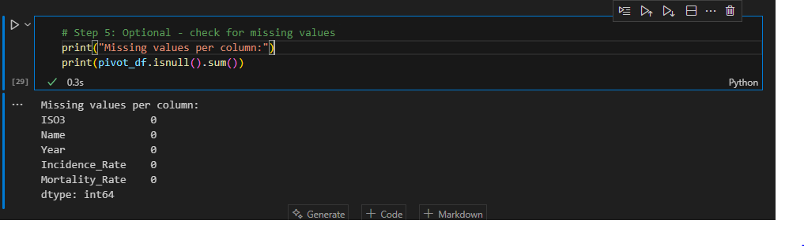
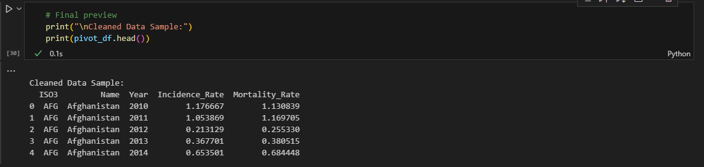
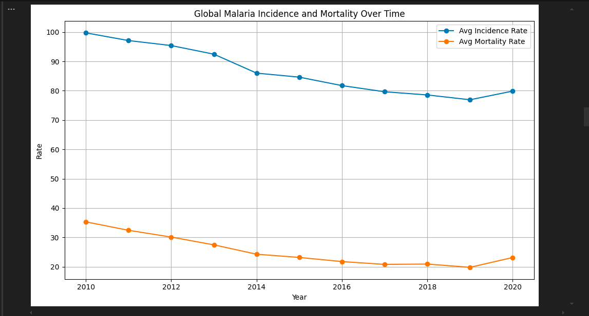
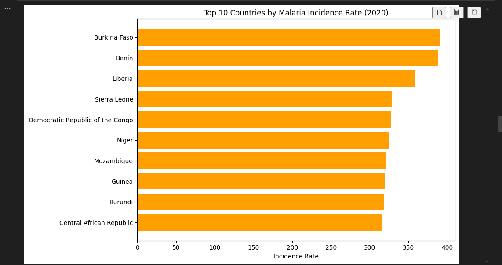
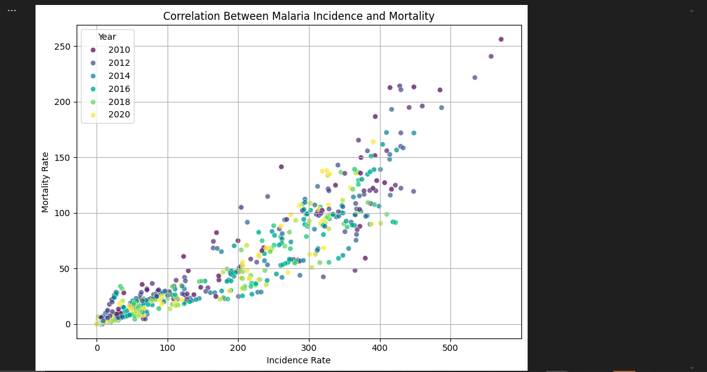
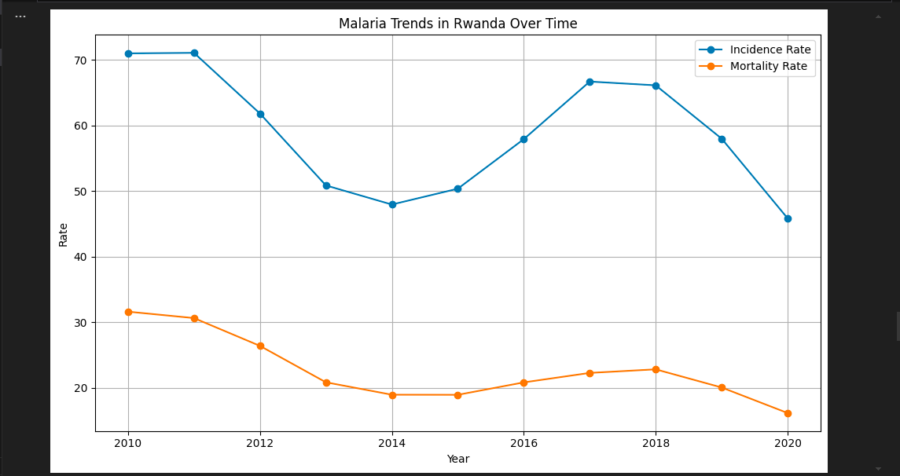
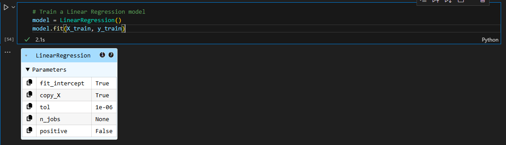
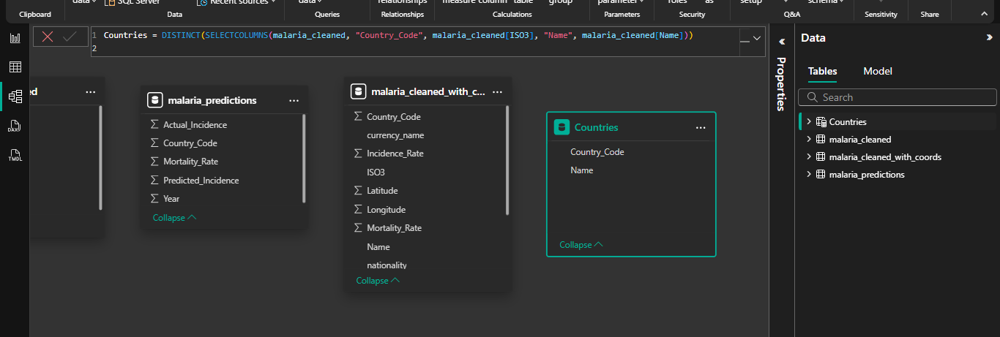
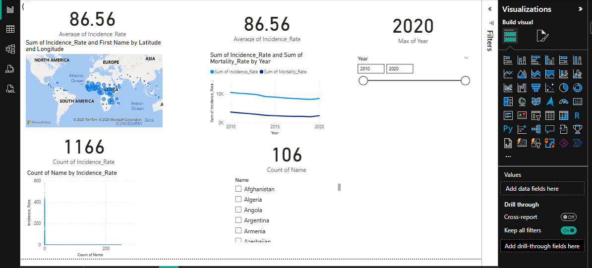
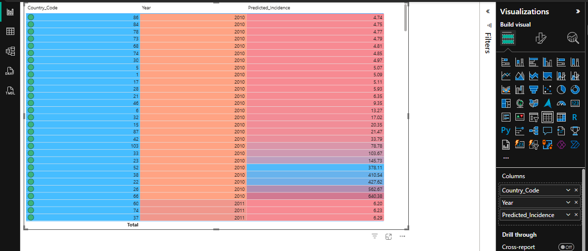

# 🦟 Malaria Incidence Prediction and Analysis

## 📌 Project Overview

This project explores and predicts malaria incidence rates using global health data. It is developed as part of a capstone project for the **Introduction to Big Data Analytics (INSY 8413)** course.

Using historical malaria metrics from national health units, we analyze trends and build a predictive model to estimate future incidence rates across various countries.

---

## 🎯 Objective

**Can we analyze and predict malaria trends over time using country-level data on incidence, mortality, and infection prevalence from a unified global health dataset?**

---

## 📁 Dataset

- **Source**: [OpenAfrica – Global Malaria National Unit Data](https://open.africa/dataset/malaria-national_unit-data/resource/9dbe7be3-f196-4b10-953b-84c36e05d99f)
- **File Used**: `openafrica-_-malaria-_-national_unit-data-raw-national_unit-data.csv.csv`

---

## 🧼 Step 1: Data Cleaning (Python 🐍)

- Removed irrelevant columns
- Handled missing values
- Formatted country codes and years
- Saved cleaned dataset as `malaria_cleaned.csv`

---

## 📊 Step 2: Exploratory Data Analysis (EDA)

- Identified key trends in malaria incidence over time
- Visualized country-level metrics
- Used heatmaps, bar charts, and line graphs

---

## 🤖 Step 3: Machine Learning – Prediction

- Used **Linear Regression** to predict malaria incidence rates by country
- Split data into training/test sets
- Evaluated model using MSE and R² score
- Generated `malaria_predictions.csv` containing forecasted results

---

## 📈 Step 4: Visualization in Power BI

- Created an interactive dashboard with:
  - Yearly trends
  - Top affected countries
  - Predicted incidence charts
  - (Optional) Map using `malaria_cleaned_with_coords.csv`

---

## 🧰 Tools Used

- **Python (pandas, matplotlib, scikit-learn)**
- **Power BI**
- **VS Code**
- **Jupyter Notebook**
- **Power point**

---

## 👨‍🎓 Author

**Rugandura Maurice**  
Capstone Project – Big Data Analytics  
Instructor: *Eric Maniraguha*

---

```python
import pandas as pd
```
```python
# Load the dataset
file_path = "openafrica-_-malaria-_-national_unit-data-raw-national_unit-data.csv.csv"
df = pd.read_csv(file_path)

```
```python
# Step 1: Filter only relevant metrics (Incidence Rate and Mortality Rate)
filtered_df = df[df["Metric"].isin(["Incidence Rate", "Mortality Rate"])]
```
```python
# Step 2: Pivot data so each row = country + year, with separate columns for each metric
pivot_df = filtered_df.pivot_table(
    index=["ISO3", "Name", "Year"],
    columns="Metric",
    values="Value"
).reset_index()
```
```python
# Step 3: Rename columns just in case
pivot_df.columns.name = None  # Remove pandas-generated name for columns
pivot_df.rename(columns={
    "Incidence Rate": "Incidence_Rate",
    "Mortality Rate": "Mortality_Rate"
}, inplace=True)
```
```python
# Step 4: Ensure Year is integer
pivot_df["Year"] = pivot_df["Year"].astype(int)
```
```python
# Step 5: Optional - check for missing values
print("Missing values per column:")
print(pivot_df.isnull().sum())
```

```python
# Final preview
print("\nCleaned Data Sample:")
print(pivot_df.head())
```


```python
pivot_df.to_csv("malaria_cleaned.csv", index=False)
```
```python
# Step 1: Load malaria cleaned data
malaria_df = pd.read_csv("malaria_cleaned.csv")
```
```python
import matplotlib.pyplot as plt
```
```python
# Step 2: Load downloaded country data
coords_df = pd.read_csv("countries.csv")
```
```python
# Step 3: Merge malaria data with country coordinates using country name
merged_df = malaria_df.merge(
    coords_df,
    left_on="Name",     # column in malaria data
    right_on="name",    # column in countries.csv
    how="left"
)
```
```python
# Step 4: Drop only the columns that actually exist in the DataFrame
columns_to_drop = [
    "name", "iso2", "iso3", "numeric_code", "phone_code", "capital", "currency",
    "currency_symbol", "tld", "native", "region", "subregion", "timezones", 
    "translations", "emoji", "emojiU", "id"
]
```
```python
# Keep only columns that exist
columns_to_drop = [col for col in columns_to_drop if col in merged_df.columns]
```
```python
# Drop them safely
merged_df.drop(columns=columns_to_drop, inplace=True)
```
```python
merged_df.rename(columns={"latitude": "Latitude", "longitude": "Longitude"}, inplace=True)
merged_df.to_csv("malaria_cleaned_with_coords.csv", index=False)
```
```python
# 🧼 Drop unnecessary columns safely
columns_to_drop = [
    "name", "iso2", "iso3", "numeric_code", "phone_code", "capital", "currency",
    "currency_symbol", "tld", "native", "region", "subregion", "timezones", 
    "translations", "emoji", "emojiU", "id"
]
```
```python
# Drop only columns that exist in your DataFrame
columns_to_drop = [col for col in columns_to_drop if col in merged_df.columns]
merged_df.drop(columns=columns_to_drop, inplace=True)
```

```python
# Rename for Power BI map fields
merged_df.rename(columns={"latitude": "Latitude", "longitude": "Longitude"}, inplace=True)
```

```python
# Save to new file
merged_df.to_csv("malaria_cleaned_with_coords.csv", index=False)

print(" Done! my file 'malaria_cleaned_with_coords.csv' is ready.")
```

```python
# Group by Year and calculate global averages
yearly_avg = pivot_df.groupby("Year")[["Incidence_Rate", "Mortality_Rate"]].mean()
```

```python
# Plot
plt.figure(figsize=(10, 6))
plt.plot(yearly_avg.index, yearly_avg["Incidence_Rate"], label="Avg Incidence Rate", marker='o')
plt.plot(yearly_avg.index, yearly_avg["Mortality_Rate"], label="Avg Mortality Rate", marker='o')
plt.title("Global Malaria Incidence and Mortality Over Time")
plt.xlabel("Year")
plt.ylabel("Rate")
plt.legend()
plt.grid(True)
plt.tight_layout()
plt.show()
```

```python
# Get the most recent year
latest_year = pivot_df["Year"].max()
```
```python
# Filter for that year
latest_data = pivot_df[pivot_df["Year"] == latest_year]
```
```python
# Top 10 countries with highest incidence
top_incidence = latest_data.sort_values("Incidence_Rate", ascending=False).head(10)
```
```python
# Plot
plt.figure(figsize=(10, 6))
plt.barh(top_incidence["Name"], top_incidence["Incidence_Rate"], color="orange")
plt.title(f"Top 10 Countries by Malaria Incidence Rate ({latest_year})")
plt.xlabel("Incidence Rate")
plt.gca().invert_yaxis()
plt.tight_layout()
plt.show()
```

```python
import seaborn as sns
```
```python
# Scatter plot
plt.figure(figsize=(8, 6))
sns.scatterplot(data=pivot_df, x="Incidence_Rate", y="Mortality_Rate", hue="Year", palette="viridis", alpha=0.7)
plt.title("Correlation Between Malaria Incidence and Mortality")
plt.xlabel("Incidence Rate")
plt.ylabel("Mortality Rate")
plt.grid(True)
plt.tight_layout()
plt.show()
```

```python
# Example: Rwanda
country_data = pivot_df[pivot_df["Name"] == "Rwanda"]
```
```python
# Plot
plt.figure(figsize=(10, 6))
plt.plot(country_data["Year"], country_data["Incidence_Rate"], label="Incidence Rate", marker='o')
plt.plot(country_data["Year"], country_data["Mortality_Rate"], label="Mortality Rate", marker='o')
plt.title("Malaria Trends in Rwanda Over Time")
plt.xlabel("Year")
plt.ylabel("Rate")
plt.legend()
plt.grid(True)
plt.tight_layout()
plt.show()
```


```python
from sklearn.model_selection import train_test_split
from sklearn.linear_model import LinearRegression
from sklearn.metrics import mean_squared_error, r2_score
from sklearn.preprocessing import LabelEncoder
import pandas as pd
```
```python
pivot_df = pd.read_csv("malaria_cleaned.csv")
```
```python
# Encode country names to numbers
le = LabelEncoder()
pivot_df["Country_Code"] = le.fit_transform(pivot_df["Name"])
```
```python
# Select features and target
X = pivot_df[["Year", "Country_Code", "Mortality_Rate"]]
y = pivot_df["Incidence_Rate"]
```
```python
# Split into training and test sets
X_train, X_test, y_train, y_test = train_test_split(X, y, test_size=0.2, random_state=42)
```
```python
# Train a Linear Regression model
model = LinearRegression()
model.fit(X_train, y_train)
```

```python
# Make predictions
y_pred = model.predict(X_test)
```
```python
# Evaluate model
mse = mean_squared_error(y_test, y_pred)
r2 = r2_score(y_test, y_pred)

print("Mean Squared Error:", mse)
print("R-squared (R²):", r2)
```


**INNOVATION**
---
```python
# Predict incidence rate in 2030 for Rwanda
rwanda_code = le.transform(["Rwanda"])[0]
future_data = pd.DataFrame({
    "Year": [2030],
    "Country_Code": [rwanda_code],
    "Mortality_Rate": [latest_data[latest_data["Name"] == "Rwanda"]["Mortality_Rate"].values[0]]
})

future_prediction = model.predict(future_data)
print("Predicted Malaria Incidence Rate in Rwanda (2030):", future_prediction[0])
```


---
```python
# This saves the cleaned malaria data for Power BI
pivot_df.to_csv("malaria_cleaned.csv", index=False)
```
```python
# Save actual vs predicted incidence rates
prediction_df = X_test.copy()
prediction_df["Actual_Incidence"] = y_test.values
prediction_df["Predicted_Incidence"] = y_pred
prediction_df.to_csv("malaria_predictions.csv", index=False)
```
```python
# Load your prediction file
pred_df = pd.read_csv("malaria_predictions.csv")
pred_df['Country_Code'] = pred_df['Country_Code'].astype(str)  # Make it a string
```
```python
# Load your cleaned dataset with country names
cleaned_df = pd.read_csv("malaria_cleaned_with_coords.csv")
cleaned_df['ISO3'] = cleaned_df['ISO3'].astype(str)  # Also make it a string
```
```python
# Merge country name into predictions using matching column
merged_df = pred_df.merge(
    cleaned_df[['ISO3', 'Name']], 
    left_on='Country_Code', 
    right_on='ISO3', 
    how='left'
)
```
```python
# Drop the ISO3 column after merge
merged_df.drop(columns=['ISO3'], inplace=True)
```
```python
# Reorder columns
merged_df = merged_df[['Name', 'Country_Code', 'Year', 'Predicted_Incidence']]
```
```python
# Save the final file
merged_df.to_csv("malaria_predictions_with_names.csv", index=False)
```
**DAX CODE**
---
```python
Countries = DISTINCT(SELECTCOLUMNS(malaria_cleaned, "Country_Code", malaria_cleaned[ISO3], "Name", malaria_cleaned[Name]))
```

**POWER BI FOR EDA**
---


**POWER BI FOR ML(Machine Learning)**
---


## Contact Us 
If you have any questions or suggestions, feel free to reach out:

📧 [mauricerugandura123@gmail.com](mailto:mauricerugandura123@gmail.com)
